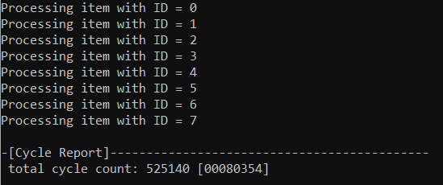
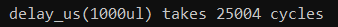
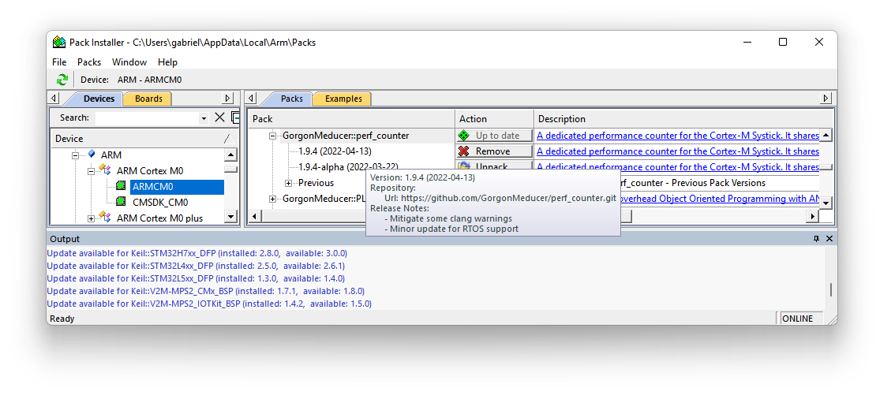
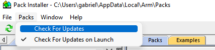
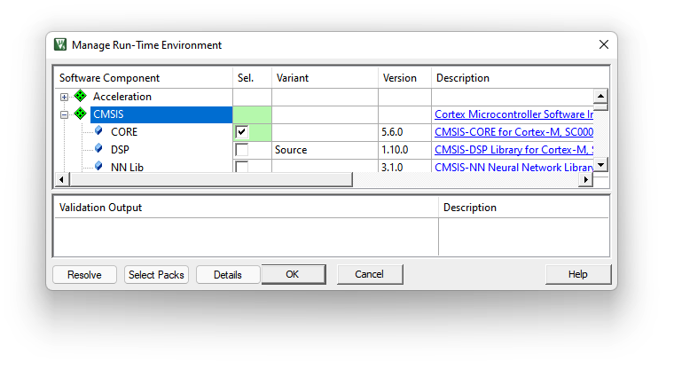
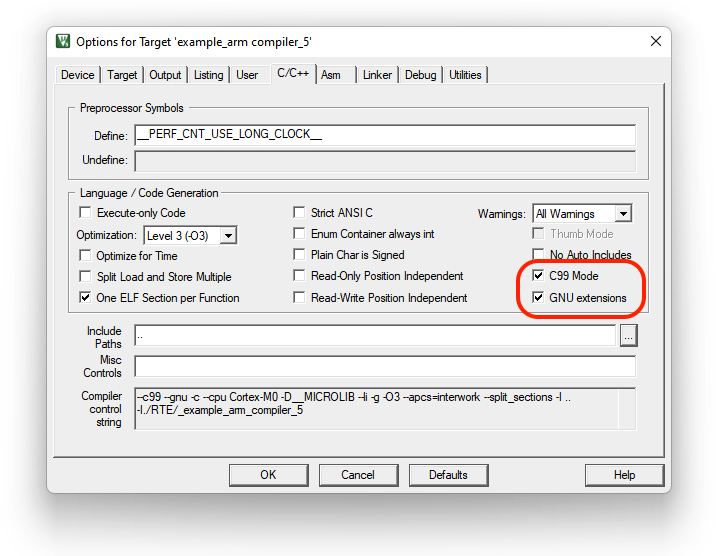
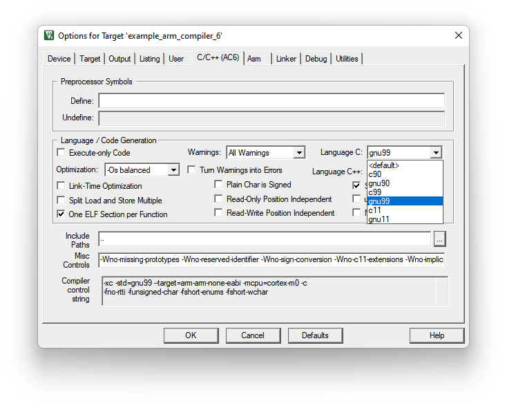
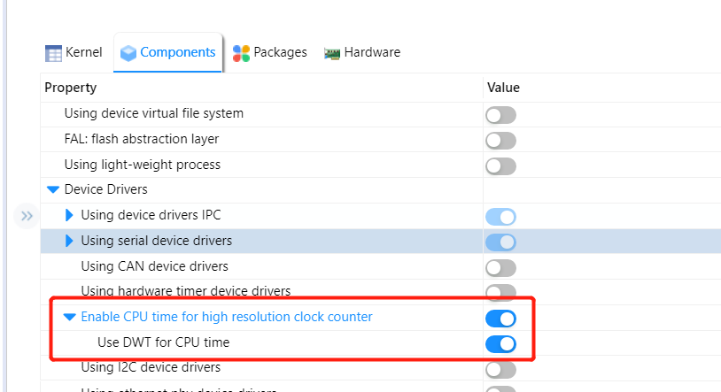

# perf_counter (v2.2.4)
A dedicated performance counter for Cortex-M Systick. It shares the SysTick with users' original SysTick function(s) without interfering with it. This library will bring new functionalities, such as performance counter,` delay_us` and `clock()` service defined in `time.h`.

### Features:

- **Measure CPU cycles for specified code segment**
- **Add Coremark 1.0**
- **Provide Timer Service for EventRecorder automatically.**
- **Enhanced measurement services for RTOS**
  - Measures **RAW / True** cycles used for specified code segment inside a thread, **i.e. scheduling cost are removed**. 
  - Measure **RAW/True** cycles used for a data-process-path across multiple threads.
- **Easy to use**
  - Helper macros: `__cycleof__()` , `__super_loop_monitor__()` etc.
  - Helper functions: `start_cycle_counter()`, `stop_cycle_counter()` etc.
- **Support ALL Cortex-M processors**
  - Including **Cortex-M85** and Star-MC1
- **Provide Free Services**
  - Do **NOT** interfer with existing SysTick based applications
- **Support ALL arm compilers**
  - Arm Compiler 5 (armcc), Arm Compiler 6 (armclang)
  - arm gcc
  - LLVM
  - IAR
- **Simplified Deployment**
  - **Drag-and-Drop deployment for Arm Compiler 5 and Arm Compiler 6.**
  - **CMSIS-Pack is available**
  - **RT-Thread package is avaialble**
- **Time based services**
  - `delay_us()` and `delay_ms()`
  - Provides Timestamp services via `get_system_ticks()`, `get_system_us` and `get_system_ms()`.
- **Support both RTOS and bare-metal environments**
  - Support SysTick Reconfiguration
  - Support changing System Frequency
  - **[new]** Support stack-overflow detection in RTOS environment via `perfc_check_task_stack_canary_safe()`
  
- **Utilities for C language enhancement**
  - Macros to detect compilers, e.g. `__IS_COMPILER_ARM_COMPILER_6__`, `__IS_COMPILER_LLVM__` etc.
  - Macro to create atomicity for specified code block, i.e. `__IRQ_SAFE{...}`
  - Helper macros for C language extension:
    - VB like `with()`
    - `foreach()`, dimof(), `CONNECT()`
    - C# like `using()`
    - simple overload feature of OOPC made out of ANSI-C99, `__PLOOC_VA_NUM_ARGS()`
    - ...


## 1. How To Use

### 1.1 Measure CPU cycles for specified code segment

You can measure specified code segment with a macro helper `__cycleof__()`, it is a wrapper of `get_system_ticks()`.

**Syntax:**

```c
__cycleof__(<Description String for the target>, [User Code, see ref 1]) {
    //! target code segment of measurement
    ...
}
```

Here, [**ref 1**] is a small user code to read the measurement result via a local variable `__cycle_count__` for perl lovers, you can also use "`_`" to read the result. This User Code is optional. If you don't put anything here, the measured result will be shown with a `printf()`. 

#### **Example 1:** Simple measurement with printf

```c
    __cycleof__() {
        foreach(example_lv0_t, s_tItem, ptItem) {
            printf("Processing item with ID = %d\r\n", _->chID);
        }
    }
```

You will see the measured result in console:

 


#### **Example 2:** Read measured result via `__cycle_counter__`

```c
    int32_t iCycleResult = 0;

    /* measure cycles and store it in a dedicated variable without printf */
    __cycleof__("delay_us(1000ul)", 
        /* insert code to __cycleof__ body, "{}" can be omitted  */
        {
            iCycleResult = __cycle_count__;   /*< "__cycle_count__" stores the result */
        }) {
        delay_us(1000ul);
    }

    printf("\r\n delay_us(1000ul) takes %d cycles\r\n", (int)iCycleResult);
```

The result is read out from `__cycle_count__`and used in other place:

 


### 1.2 Timestamp

You can get the system timestamp (since the initialization of perf_counter service) via function `get_system_ticks()` and `get_system_ms()`. 

**NOTE**: The `get_system_ms()` is **NOT** a wrapper of the function `get_system_ticks()`. 


There are various way to take advantage of those functions. 

#### Example 3: Use `get_system_ms()` as random seed

```c
#include <stdio.h>
#include <stdlib.h>
#include "perf_counter.h"

int main (void) 
{
   int i, n;
   
   n = 5;
   
   /* Intializes random number generator */
   srand((unsigned) get_system_ticks());

   /* Print 5 random numbers from 0 to 1024 */
   for( i = 0 ; i < n ; i++ ) {
      printf("%d\n", rand() & 0x3FF);
   }
   
   return(0);
}
```


#### Example 4: Measure CPU cycles

```c
    do {
        int64_t tStart = get_system_ticks();
        __IRQ_SAFE {
            printf("no interrupt \r\n");
        }
        printf("used clock cycle: %d", (int32_t)(get_system_ticks() - tStart));
    } while(0);
```

This example shows how to use the delta value of `get_system_ticks()` to measure the CPU cycles used by specified code segment. In fact, the `__cycleof__()` is implemented in the same way:

```c
#define __cycleof__(__STR, ...)                                                 \
            using(int64_t _ = get_system_ticks(), __cycle_count__ = _,          \
                _=_, {                                                          \
                _ = get_system_ticks() - _;                                     \
                __cycle_count__ = _;                                            \
                if (__PLOOC_VA_NUM_ARGS(__VA_ARGS__) == 0) {                    \
                    printf("\r\n");                                             \
                    printf("-[Cycle Report]");                                  \
                    printf("--------------------------------------------\r\n"); \
                    printf(__STR " total cycle count: %d [%08x]\r\n",           \
                            (int)_, (int)_);                                    \
                } else {                                                        \
                    __VA_ARGS__                                                 \
                };                                                              \
            })
```


### 1.3 Timer Services

perf_counter provides the basic timer services for delaying a given period of time and polling-for-timeout. For example:

```c
delay_ms(1000);   /* block the program for 1000ms */
delay_us(50);	  /* block the program for 50us */

while(1) {
    /* return true every 1000 ms */
    if (perfc_is_time_out_ms(1000)) {
        /* print hello world every 1000 ms */
        printf("\r\nHello world\r\n");
    }
}
```


### 1.4 Work with EventRecorder in MDK

If you are using EventRecorder in MDK, once you deployed the `perf_counter`, it will provide the timer service for EventRecorder by implenting the following functions: `EventRecorderTimerSetup()`, `EventRecorderTimerGetFreq()` and `EventRecorderTimerGetCount()`. 

If you have not modify anything in `EventRecorderConf.h`, **you don't have to**, and please keep the default configuration.  If you see warnings like this:

```
Invalid Time Stamp Source selected in EventRecorderConf.h!
```

Please set the macro `EVENT_TIMESTAMP_SOURCE` to `3` to suppress it.

**IMPORTANT**: Please always make sure the macro `EVENT_TIMESTAMP_FREQ` is `0`


**By using perf_counter as the reference clock, EventRecorder can have the highest clock resolution on the target system without worring about the presence of DWT or any conflicting usage of SysTick.** 


### 1.5 On System Environment Changing

#### 1.5.1 System Frequency Changing

If you want to change the System Frequency, **after** the change, make sure:

1. The `SystemCoreClock` has been updated with the new system frequency. Usually, the HAL will update the `SystemCoreClock` automatically, but in some rare cases where `SystemCoreClock` is updated accordingly, you should do it yourself.

2. please call `update_perf_counter()` to notify perf_counter.


#### 1.5.2 Reconfigure the SysTick

Some systems (e.g. FreeRTOS) might reconfigure the systick timer to fulfil the requirement of their feature. To support this:

1. **Before the reconfiguration**, please call function `before_cycle_counter_reconfiguration()`.  

   **NOTE**: This function will stop the SysTick, clear the pending bit, and set the Load register and the Current Value registers to zero.

2. After the reconfiguration, please call `update_perf_counter()` to notify perf_counter the new changes. 


## 2. How To Deploy

### 2.1 Generic(Default) method for all compilers

#### 2.1.1 For Bare-metal:

1. Clone the code to your local with following command lines:

```shell
git clone https://github.com/GorgonMeducer/perf_counter.git
```

2. Add including path for `perf_counter` folder
3. Add `perf_counter.c` to your compilation 
4. Include `perf_counter.h` in corresponding c source file:

```c
#include "perf_counter.h"
```


5. Make sure your system contains the CMSIS (with a version 5.7.0 or above) as `perf_counter.h` includes `cmsis_compiler.h`. 
6. Call the function `user_code_insert_to_systick_handler()` in your `SysTick_Handler()`

```c
void SysTick_Handler(void)
{
    ...
    user_code_insert_to_systick_handler();
    ...
}
```


7. Make sure the `SystemCoreClock` is updated with the same value as CPU frequency. 
8. **IMPORTANT**: Make sure the `SysTick_CTRL_CLKSOURCE_Msk` bit ( bit 2) of `SysTick->CTRL` register is `1` that means SysTick runs with the same clock source as the target Cortex-M processor. 
9. Initialize the perf_counter with boolean value that indicates whether the user applications and/or RTOS have already occupied the SysTick.

```c
void main(void)
{
    //! setup system clock 
    
    /*! \brief Update SystemCoreClock with the latest CPU frequency
     *!        If the function doesn't exist or doesn't work correctly,
     *!        Please update SystemCoreClock directly with the correct
     *!        system frequency in Hz.
     *!       
     *!        extern volatile uint32_t SystemCoreClock;
     */
    SystemCoreClockUpdate();
    
    /*! \brief initialize perf_counter() and pass true if SysTick is 
     *!        occupied by user applications or RTOS, otherwise pass
     *!        false. 
     */
    init_cycle_counter(true);
    
    ...
    while(1) {
        ...
    }
}
```

10. **IMPORTANT**: Please enable GNU extension in your compiler. For **GCC** and **CLANG**, it is `--std=gnu99` or `--std=gnu11`, and for other compilers, please check the user manual first. Failed to do so, you will not only trigger the warning in `perf_counter.h`, but also lose the function correctness of `__cycleof__()` and `__super_loop_monitor__()`, because `__PLOOC_VA_NUM_ARGS()` isn't report `0` when passed with no argument. 

```c
#if __PLOOC_VA_NUM_ARGS() != 0
#warning Please enable GNC extensions, it is required by __cycleof__() and \
__super_loop_monitor__()
#endif
```

11. It is nice to add macro definition `__PERF_COUNTER__` to your project GLOBALLY. It helps other module to detect the existence of perf_counter. For Example, LVGL [`lv_conf_cmsis.h`](https://github.com/lvgl/lvgl/blob/d367bb7cf17dc34863f4439bba9b66a820088951/env_support/cmsis-pack/lv_conf_cmsis.h#L81-L99) use this macro to detect perf_counter and uses `get_system_ms()` to implement `lv_tick_get()`.


**Enjoy !**


### 2.2 Use cmsis-pack in MDK

1. Download the cmsis-pack from the`cmsis-pack` folder. It is a file with name `GorgonMeducer.perf_counter.<version>.pack`, for example `GorgonMeducer.perf_counter.2.2.0.pack`

2. Double click it to install this cmsis-pack. Once finished, you can find it in your Pack-Installer:

   
   In the future, you can pull the latest version of perf_counter from the menu `Packs->Check For Updates` as shown below:

    

   

3. Open the RTE management window, find the **Utilities** and select the **Core** inside perf_counter as shown below:

 

4. Include `perf_counter.h` in corresponding c source file:

```c
#include "perf_counter.h"
```


5. Make sure your system contains the CMSIS (with a version 5.7.0 or above) as `perf_counter.h` includes `cmsis_compiler.h`.  Usually, you should do this with RTE as shown below:

 

6. Make sure the `SystemCoreClock` is updated with the same value as CPU frequency. 
7. **IMPORTANT**: Make sure the `SysTick_CTRL_CLKSOURCE_Msk` bit ( bit 2) of `SysTick->CTRL` register is `1` that means SysTick runs with the same clock source as the target Cortex-M processor. 
8. Initialize the perf_counter with boolean value that indicates whether the user applications and/or RTOS have already occupied the SysTick.

```c
void main(void)
{
    //! setup system clock 
    
    /*! \brief Update SystemCoreClock with the latest CPU frequency
     *!        If the function doesn't exist or doesn't work correctly,
     *!        Please update SystemCoreClock directly with the correct
     *!        system frequency in Hz.
     *!       
     *!        extern volatile uint32_t SystemCoreClock;
     */
    SystemCoreClockUpdate();
    
    /*! \brief initialize perf_counter() and pass true if SysTick is 
     *!        occupied by user applications or RTOS, otherwise pass
     *!        false. 
     */
    init_cycle_counter(true);
    
    ...
    while(1) {
        ...
    }
}
```

9. **IMPORTANT**: Please enable GNU extension in your compiler. 

   For Arm Compiler 5, please select both **C99 mode** and GNU extensions in the **Option for target dialog** as shown below:

 

For Arm Compiler 6, please select **gnu99** or **gnu11** in Language C drop-list as shown below:

 

Failed to do so, you will not only trigger the warning in `perf_counter.h`, but also lose the function correctness of `__cycleof__()` and `__super_loop_monitor__()`, because `__PLOOC_VA_NUM_ARGS()` isn't report `0` when passed with no argument. 

```c
#if __PLOOC_VA_NUM_ARGS() != 0
#warning Please enable GNC extensions, it is required by __cycleof__() and \
__super_loop_monitor__()
#endif
```

### 2.3 Use perf_counter in RT-Thread RTOS

perf_counter has registered as one of the [RT-Thread software packages](https://packages.rt-thread.org/en/detail.html?package=perf_counter), which locats in `system` category. In [ENV](https://www.rt-thread.io/download.html?download=Env) or [RT-Thread Studio](https://www.rt-thread.io/download.html?download=Studio), you just need to simply enable cputime framework. RT-Thread will automatically enable perf_counter if you are using Cortex-M architecture.

 

**Enjoy !**


## 3. FAQ

### 3.1 Why I see `Undefined symbol $Super$$SysTick_Handler` 

This error usually pops up in **Arm Compiler 5** and **Arm Compiler 6**. It is because you haven't implemented any non-weak `SysTick_Handler()`.  Please provide an EMPTY one in any c source file to solve this problem:

```c
void SysTick_Handler(void)
{
}
```

**NOTE**: If you deploy perf_counter using cmsis-pack and encounter this issue, please **DO NOT** call function `user_code_insert_to_systick_handler()` in this **should-be-empty** `SysTick_Handler()`. 

### 3.2 Why do I see perf_counter in red in the MDK project manager?

Since version v2.1.0 I removed the unnecessary bundle feature from the cmsis-pack. If you have used the older version, you will encounter this issue. To solve this problem: 

1. please unselect ALL the performance components in RTE, press OK and close the uVision. 
2. reopen the mdk project and select the perf_counter components in RTE


Sorry about this.  


## 4.  License

**Performance Counter for Cortex-M**, a.k.a. ***perf_counter*** is under Apache 2.0 license. 
